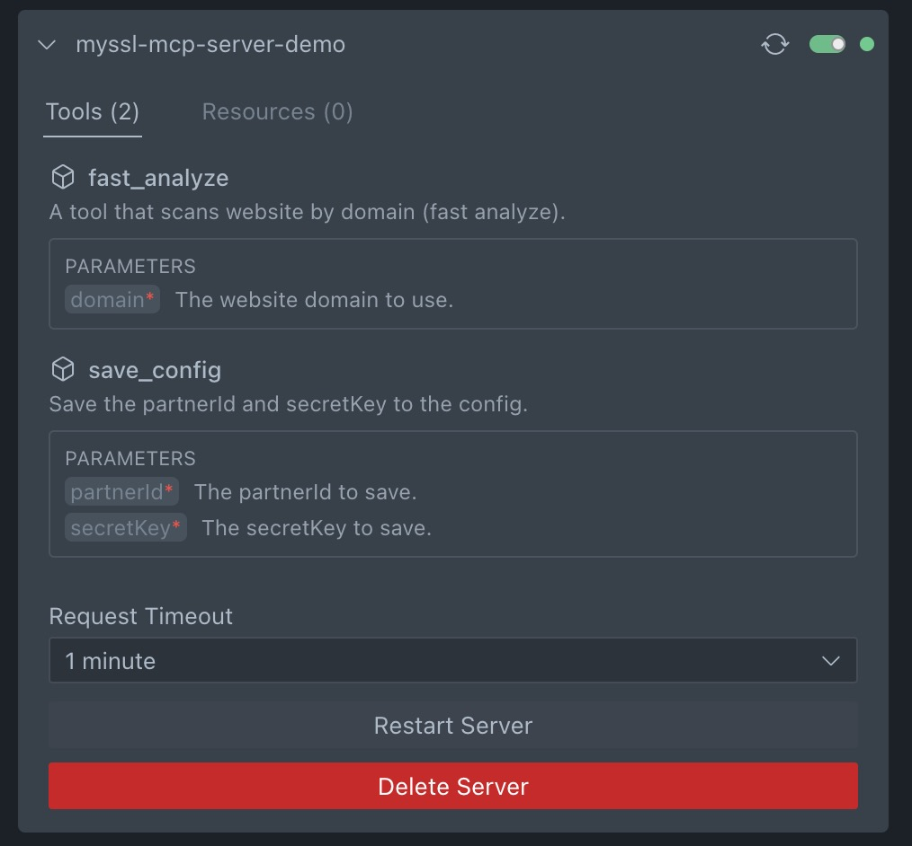
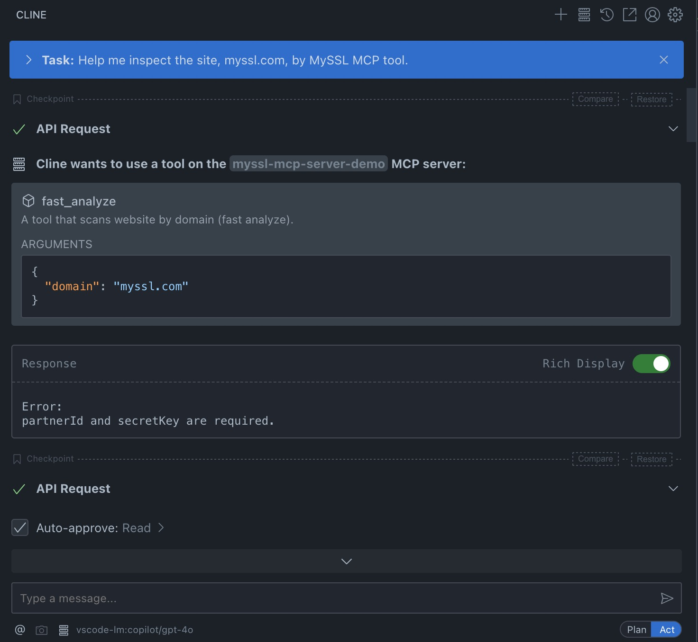
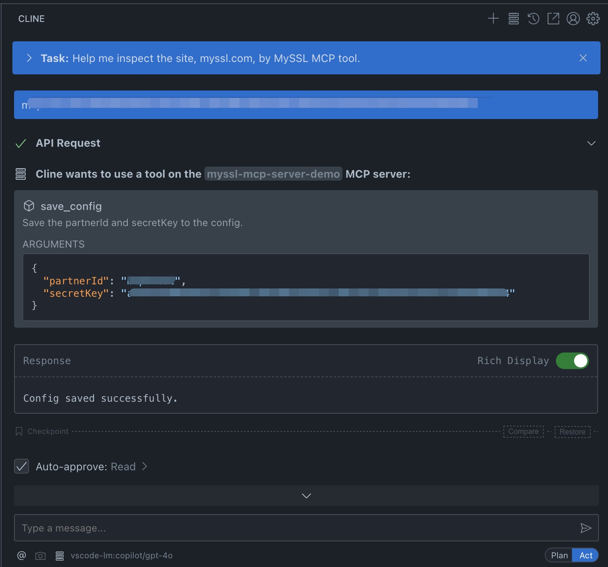
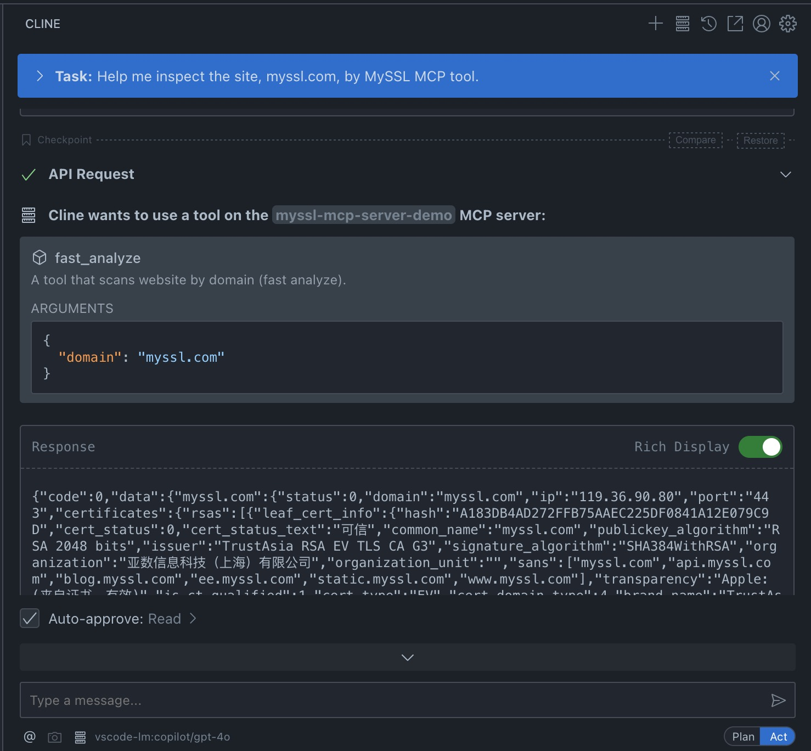
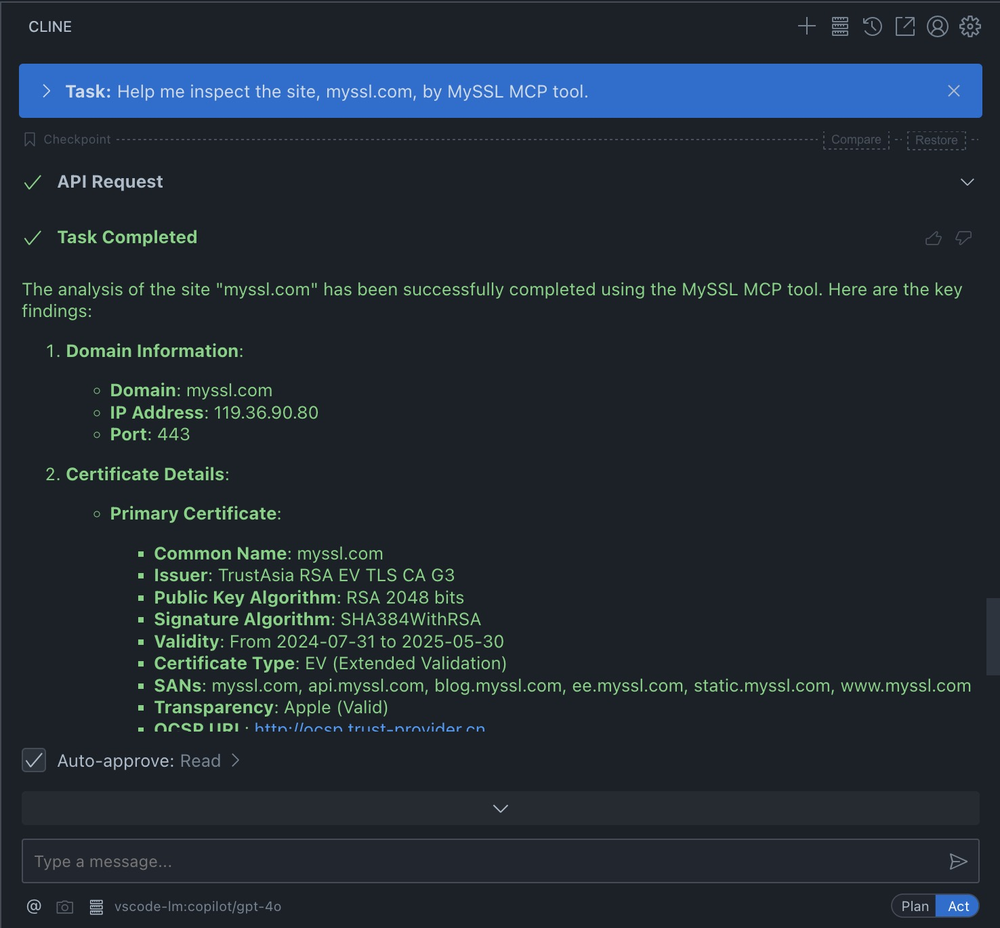

# MySSL MCP Server

## What is MySSL MCP Server?

MySSL is a site inspection tool developed by TrustAsia (official website: [MySSL](https://myssl.com)), which supports a series of inspections for site security certificates. With MySSL MCP, it is possible to integrate with LLM models. The MySSL MCP inspection tool can inspect sites and provide inspection results for further analysis and processing by LLM models.

Below is a demonstration of configuring MySSL MCP and performing site inspection using Cline.

## Demonstration with Cline

1. **Install Cline**  
    Follow the official documentation to install Cline on your VSCode.

2. **Configure MySSL MCP**  
    Use the provided JSON configuration file and replace the placeholders (`{{PATH_TO_UV}}` and `{{PATH_TO_SRC}}`) with the appropriate paths on your system.

    

3. **Run the Inspection and View Results**  
    Ask Cline to inspect a site (it may request configuration information).
    
    

    

    

    

## Supportted features

* fast scan

# Installation

## Prerequisites

* Python 3.12+
* Anthropic Claude Desktop app (or Cursor, or Cline)
* UV (Python package manager), install with curl -LsSf https://astral.sh/uv/install.sh | sh

## Steps

1. Clone repository

```
git clone https://github.com/trustasia-com/myssl-mcp-server-python.git
```

2. Configure MCP server and run

Copy the below json with the appropriate {{PATH}} values:

```
{
  "mcpServers": {
    "myssl-mcp-server": {
      "command": "{{PATH_TO_UV}}", // Run `which uv` and place the output here
      "args": [
        "--directory",
        "{{PATH_TO_SRC}}/myssl-mcp-server-python/myssl-mcp-server",
        "run",
        "server.py"
      ]
    }
  }
}
```